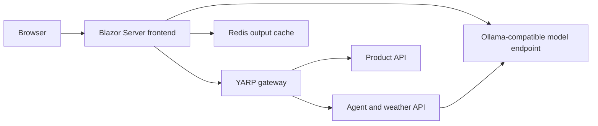
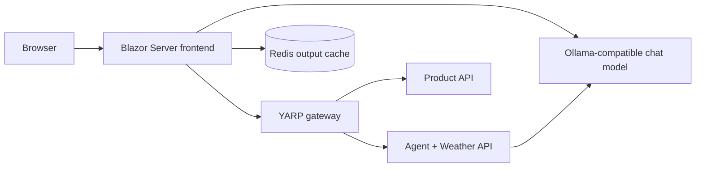

# AiAgentAspireApp — Microsoft Agent Framework Sample

## Project Summary

This is a .NET 10 web application demonstrating the Microsoft Agent Framework with .NET Aspire. It combines a Blazor Server UI, two backend APIs, a YARP gateway, Redis output caching, and an Ollama-compatible model endpoint. The solution contains five projects, listed in `AiAgentAspireApp.slnx`.



## Runtime and Services

- `AppHost.cs` defines the application topology. Aspire starts Redis, the model resource, the APIs, the gateway, and the frontend, and configures startup dependencies between them.
- The model is configured as `gpt-oss:120b-cloud` at `http://localhost:11434/v1`, using an OpenAI-compatible Ollama endpoint and a placeholder API key. The local Ollama service must therefore be available and able to serve that model.
- The gateway routes `/agent/api/...` to the agent API and `/product/api/...` to the product API, stripping those prefixes before forwarding.
- The app also configures an anonymous-access Dev Tunnel referencing the gateway and frontend. That may make development resources reachable outside the local machine, so it deserves attention before using this setup with sensitive data.
- Shared conventions in `Extensions.cs` add service discovery, standard HTTP resilience, health checks, and OpenTelemetry instrumentation. Health endpoints are mapped in development; OTLP export is enabled when an exporter endpoint is configured.

## Agent API

The API service registers a chat client and two agents:

- **Writer** is instructed to create stories. It has two tools: `GetAuthor`, which returns "Jack Torrance," and `FormatStory`, which formats a title, author, and story.
- **Editor** is instructed to improve a draft and provide recommendations plus a revised Markdown version.
- `GET /agent/chat?prompt=...` creates a round-robin group-chat workflow with a maximum of two iterations, adds Writer and Editor, and streams text back as `text/plain`.
- `GET /weatherforecast` returns five randomly generated forecasts for upcoming dates.

The agent API's workflow is created anew for each request. There is no server-side conversation store in this code.

## Frontend and User Flows

The web project uses interactive server-rendered Razor components, registers clients for the gateway APIs, registers its own chat client, and enables Redis-backed output caching in `Program.cs`. Its navigation exposes two agent-chat pages, Weather, and Product.

- **`/aichat`** runs the Writer/Editor workflow directly in the Blazor app using its injected chat client. Its Writer has the author and formatting tools.
- **`/aiagetapi`** sends the prompt to the separate agent API through `AgentApiClient`, which reads the HTTP response as a stream and updates the UI as text arrives.
- **`/weather`** and **`/product`** fetch and display backend data in tables. Both pages use stream rendering and a five-second output-cache attribute. The product page is backed by `ProductApiClient.cs`.
- `Home.razor` is still the default "Hello, world!" page. Counter is also a standard template example, though it is not in the navigation.

The two chat pages keep past messages in the displayed UI, but each send passes only the new prompt to a newly created workflow. In other words, the visible transcript does not provide conversational memory to the model.

## Notable Caveats

- Agent output is converted from Markdown to HTML and rendered as `MarkupString` in the chat components. For production use, sanitize rendered output, especially if prompts or model responses could contain untrusted HTML.
- The AppHost configures the Dev Tunnel for anonymous access; review which services it exposes before sharing a running instance.
- The Microsoft Agent Framework package versions differ between the API and web projects, and are preview versions. That may complicate upgrades or dependency alignment.
- The README at the workspace root contains screenshots but no written setup or architecture guide. The solution listing also does not include a test project.

---

A .NET 10 sample built with **.NET Aspire** and the **Microsoft Agent Framework**, showing how to host AI agents behind an API, orchestrate a multi-agent workflow, and consume it from a Blazor Server front end — alongside two plain demo APIs (weather and product) wired through a YARP gateway.

> Screenshots of the running app (Aspire dashboard, chat pages, weather/product pages) are available in [README.md](README.md).

## Overview

The solution spins up, via a single Aspire AppHost:

- A **chat model resource** (Ollama, OpenAI-compatible endpoint) that other services reference.
- An **Agent API** (`AiAgentAspireApp.ApiService`) hosting two named AI agents — **Writer** and **Editor** — composed into a round-robin group-chat workflow, plus a demo weather endpoint.
- A **Product API** (`PrductApi`) returning demo product data.
- A **YARP gateway** that routes `/agent/api/**` to the Agent API and `/product/api/**` to the Product API.
- A **Blazor Server web app** (`AiAgentAspireApp.Web`) with pages for agent chat (two different implementations), weather, and products, backed by Redis output caching.
- A **Dev Tunnel** (anonymous access) exposing the gateway and web app for external access during development.



## Solution Structure

| Project | Purpose |
|---|---|
| `AiAgentAspireApp.AppHost` | Aspire orchestration: declares Redis, the model resource, the two APIs, the YARP gateway, the web app, and the dev tunnel. |
| `AiAgentAspireApp.ApiService` | Hosts the Writer/Editor agents and exposes `/agent/chat` (streaming) and `/weatherforecast`. |
| `PrductApi` | Minimal API exposing `/products` with generated demo data. |
| `AiAgentAspireApp.Web` | Blazor Server UI — agent chat pages, weather page, product page. |
| `AiAgentAspireApp.ServiceDefaults` | Shared Aspire conventions: service discovery, resilience, health checks, OpenTelemetry. |

## Agents

Both the API service and the web app define a **Writer** and an **Editor** agent (defined independently in each project):

- **Writer** — crafts a story from the user's prompt. Has two tools:
  - `GetAuthor()` → returns a fixed author name.
  - `FormatStory(title, author, story)` → formats the final output.
- **Editor** — reviews the Writer's draft and returns concise recommendations plus a fully revised Markdown version.

These are composed using `AgentWorkflowBuilder.CreateGroupChatBuilderWith(...)` into a **round-robin group chat** (max 2 iterations) and run via `RunStreamingAsync`, with text chunks streamed to the caller as they're produced.

> Note: each request builds a fresh workflow. There is no server-side conversation memory — the UI keeps prior messages for display, but only the current prompt is sent to the model on each turn.

## Web App Pages

| Route | Description |
|---|---|
| `/` | Default Blazor template home page. |
| `/aichat` | Runs the Writer/Editor workflow **in-process** using the web app's own injected chat client. |
| `/aiagetapi` | Sends the prompt to the **Agent API** (via the gateway) and streams the response through `AgentApiClient`. |
| `/weather` | Calls `/agent/api/weatherforecast` through the gateway and renders a table of forecasts. |
| `/product` | Calls `/product/api/products` through the gateway and renders a table of products. |
| `/counter` | Unmodified Blazor template sample (not in the nav menu). |

## API Endpoints

**Agent API** (`AiAgentAspireApp.ApiService`):
- `GET /agent/chat?prompt={text}` — streams the Writer/Editor group-chat output as `text/plain`.
- `GET /weatherforecast` — returns 5 generated forecasts.
- `GET /health`, `/alive` — health checks (development only).

**Product API** (`PrductApi`):
- `GET /products` — returns 5 generated demo products.

All cross-service traffic from the web app goes through the **YARP gateway**, which strips the `/agent/api` and `/product/api` prefixes before forwarding.

## Prerequisites

- .NET 10 SDK.
- [.NET Aspire workload](https://learn.microsoft.com/dotnet/aspire/fundamentals/setup-tooling) tooling.
- A local [Ollama](https://ollama.com/) instance (or compatible OpenAI endpoint) reachable at `http://localhost:11434/v1`, serving the model configured in `AppHost.cs` (currently `gpt-oss:120b-cloud`; `llama3.2` is available as a commented-out alternative).
- Docker (for the Redis container Aspire provisions).

## Running the App

1. Ensure Ollama is running locally and has the configured model available.
2. From the solution folder, run the AppHost project:
   ```powershell
   dotnet run --project AiAgentAspireApp.AppHost
   ```
3. Open the Aspire dashboard link printed in the console to see all resources, logs, and traces.
4. Launch the `webfrontend` resource from the dashboard (or its printed URL) and navigate to **AI Agents**, **AI Agents api**, **Weather**, or **Product** from the nav menu.

## Configuration Notes

- `ASPIRE_ALLOW_UNSECURED_TRANSPORT` is enabled in the AppHost's `appsettings.json` for local development over HTTP.
- The model API key in `AppHost.cs` is a placeholder secret parameter (`ollama-api-key`) — Ollama doesn't require a real key, but the parameter plumbing mirrors how a real OpenAI-compatible provider would be configured.
- The Dev Tunnel is configured for **anonymous access**; be mindful of this if running the sample on a machine where you don't want the gateway/web app exposed externally.

## Known Limitations

- No persisted conversation history — each chat turn is a new workflow run.
- Weather and Product data are randomly generated, not backed by real stores.
- Agent responses are rendered as Markdown→HTML (`MarkupString`) in the Blazor pages; treat this as a sample pattern, not a hardened one, if model output could ever include untrusted content.
- Package versions for `Microsoft.Agents.AI*` differ slightly between the API and web projects and are preview releases.

## Application execution screen output with the chat prompts responses.


